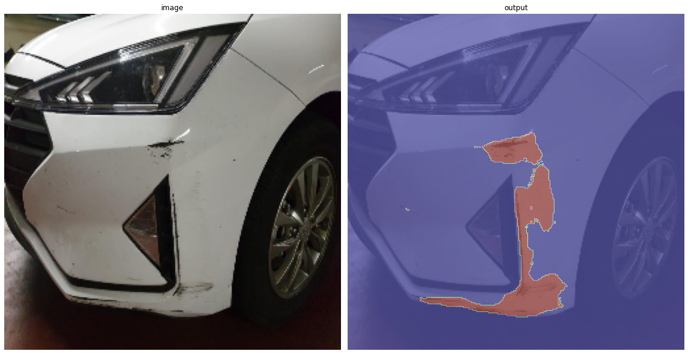
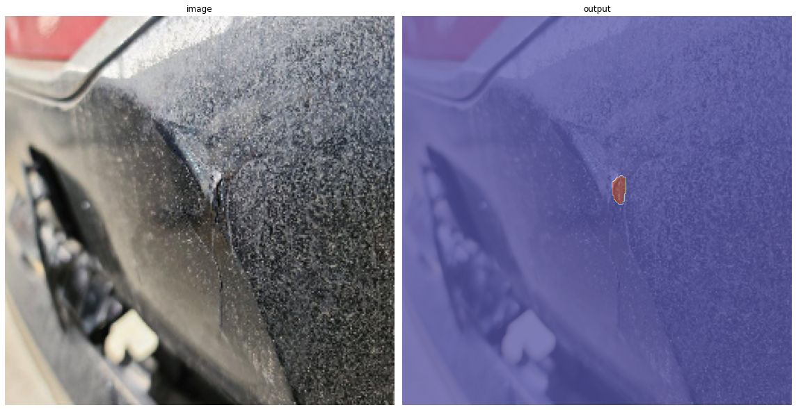
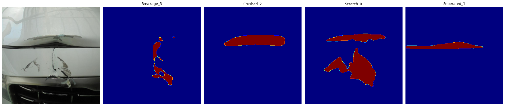

# 차량 파손 영역 탐지

차량 파손 영역 Segmentation 모델 (UNet 기반)

Car crash damge detection and segmentation using UNet.

## 사전 학습 모델 Pretrained models

- `[DAMAGE][Breakage_3]Unet.pt` : 파손
- `[DAMAGE][Crushed_2]Unet.pt` : 찌그러짐
- `[DAMAGE][Scratch_0]Unet.pt` : 스크래치
- `[DAMAGE][Seperated_1]Unet.pt` : 이격

https://drive.google.com/drive/folders/1q0l5vT14Kka_iu0WZgn1EFJLUbWD8EtY?usp=sharing

## 데이터셋

[차량 파손 이미지 - AI허브](https://www.aihub.or.kr/aihubdata/data/view.do?dataSetSn=581)

## 도움

- AI허브 : 영상 제작 지원
- 쏘카 : 사전 학습 모델 제공

## Dependency

- pandas==1.3.4
- opencv-python==4.5.4.60
- torch==1.10.1
- segmentation-models-pytorch==0.2.1
- albumentations==1.1.0
- pytz==2021.3
